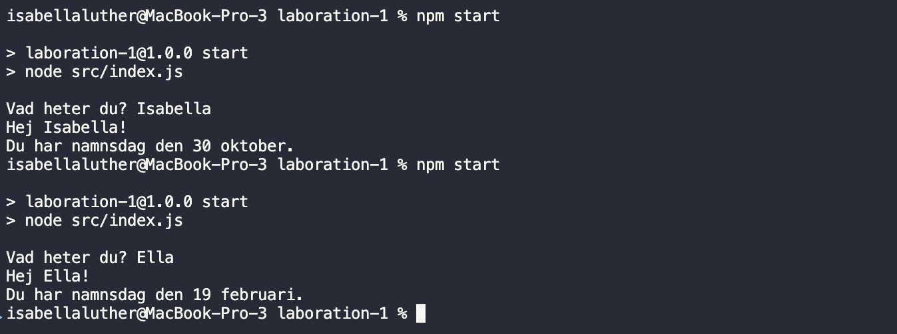

# Reflektion: Laboration 1 – Fortsätt programmera

## 1. Att fortsätta programmera

*Vilka kunskaper och färdigheter från tidigare kurser bygger du vidare på i den här uppgiften? Vad var mest utmanande? Vad vill du utveckla vidare i din programmering framöver?*

Svar:

Jag byggde vidare på tidigare kunskaper i JavaScript, Node.js och Git.

Det som var mest utmanande var namnsdagsdatan. Den första datakällan jag testade var dokumenterad som ett JSON-API, men när jag anropade den från programmet returnerade den HTML i stället för JSON. Jag felsökte svaret och valde därför att byta till ett annat API.

Framöver vill jag bli bättre på att läsa API-dokumentation, även om dokumentationen i det här fallet var missvisande, samt bli bättre på felsökning och på att strukturera min kod.

## 2. Arbetsflödet

*Hur kändes det att arbeta med Git och använda kursens plattformar?*

Svar:

Det kändes ganska naturligt eftersom jag har arbetat med Git tidigare. Jag försökte göra mindre commits under arbetets gång för att lättare kunna följa hur programmet utvecklades.

*Varför valde du GitLab eller GitHub för din kod? Vad vägde du in — till exempel integritet, att bygga en publik portfolio, eller vana? Om GitHub — länk till ditt repo:*

Svar:

Jag valde GitHub eftersom jag vill bli mer van vid att arbeta där och samtidigt samla mina projekt som en del av en publik portfolio.

Repo:

https://github.com/isabellaluther/1DV610-L1

## 3. Bedömning och att dela publikt

*Uppgiften bedöms inte på kodens stil eller kvalitet, bara på en komplett inlämning. Påverkade det hur du arbetade? Och hur kändes det att posta din skärmdump/video publikt i Zulip, utan möjlighet att göra det privat?*

Svar:

Det gjorde att jag kunde fokusera på att få programmet att fungera med lite mindre press. Samtidigt valde jag ändå att försöka fortsätta med samma typ av standard som jag använt tidigare, till exempel tydliga variabelnamn, JSDoc och kommentarer.

Att dela resultatet publikt i Zulip känns lite mer utlämnande än en privat inlämning, men det är samtidigt intressant att kunna se hur andra har löst samma uppgift.

## 4. Ditt program

*Vilket programmeringsspråk valde du, och varför just det?*

Svar:

Jag valde JavaScript med Node.js eftersom det är ett språk och en miljö som jag har arbetat mycket med tidigare och känner mig bekväm med. Det gjorde att jag kunde fokusera på själva uppgiften i stället för att behöva lära mig ett nytt språk eller en ny utvecklingsmiljö.

*Vad gjorde du för att göra välkomstmeddelandet till något mer än bara `"Hej " + namn`?*

Svar:

Programmet frågar användaren efter ett namn och använder sedan ett externt kalender-API för att söka efter personens namnsdag. Om namnet finns visas namnsdagen i ett mer läsbart format, till exempel:

`Du har namnsdag den 30 oktober.`

Programmet validerar också tom input och har felhantering om API-anropet skulle misslyckas.

## 5. AI-samarbete

*Samarbetade du med någon AI-assistent (t.ex. ChatGPT, GitHub Copilot, Claude) — som en kollega snarare än bara ett verktyg? Beskriv kort hur, och ge gärna ett exempel på en prompt som gav ett bra resultat.*

Svar:

Ja, jag använde ChatGPT som visst stöd under arbetet. Jag använde det framför allt för att diskutera idéer, men också för att förstå vissa felmeddelanden när jag behövde stöd i felsökningen.

Ett exempel var när programmet gav felet `Unexpected token '<'` när jag försökte läsa ett API-svar som JSON. Jag använde ChatGPT för att förstå vad felet betydde och kunde sedan se att API:t faktiskt returnerade HTML i stället för JSON.

## 6. Bild eller video

*Bifoga (eller länka till) samma skärmdump/video som du postat i Zulip.*

Svar:

[Se min skärmdump/video i Zulip](https://zulip.lnu.se/#narrow/channel/19-1dv610/topic/HT26.20-.20Laboration.201.20-.20Visa.20och.20ber.C3.A4tta/near/8434)